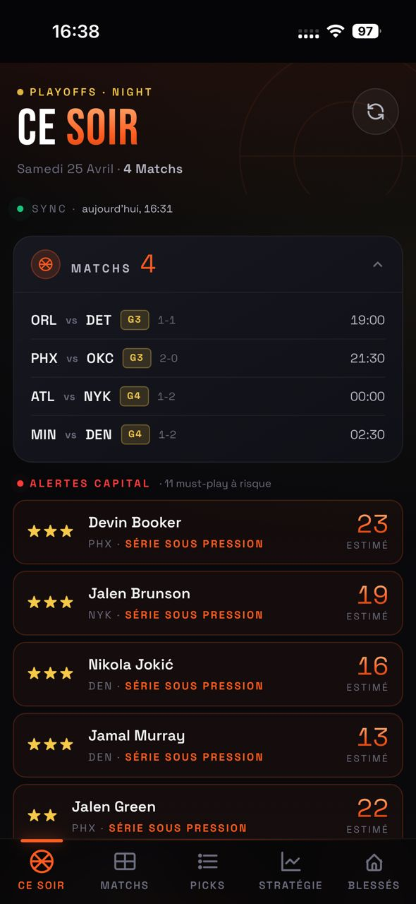
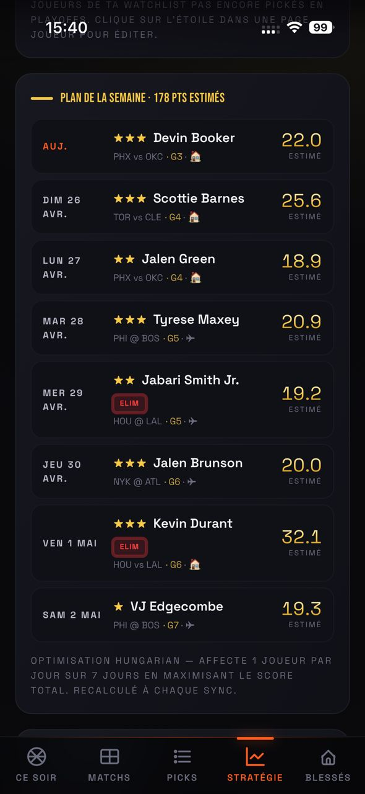

# TTFL Advisor

Outil d'aide à la décision pour la **TrashTalk Fantasy League** (TTFL). Chaque soir, l'app recommande les meilleurs picks parmi les joueurs NBA disponibles, avec un argumentaire détaillé. En playoffs, un moteur stratégique protège tes franchise-players pour les tours suivants.

App live : **https://ttfl-advisor.vercel.app/** (PWA installable sur mobile)

<p>
  
  
</p>

*À gauche, l'accueil « Ce soir » : les matchs du jour et les alertes sur les joueurs à jouer d'urgence. À droite, le plan de la semaine : un pick optimal par jour, calculé par l'algo hongrois. [Plus de captures dans le guide utilisateur.](docs/guide-utilisateur.md)*


## Ce que ça fait

- **Scoring 6 facteurs** : forme pondérée L5/L10/L20, matchup défensif par poste, split home/away, fatigue (back-to-backs), tendance, régularité floor/ceiling
- **Burn or save** : en playoffs, compare le score de ce soir au meilleur score estimé sur 7 jours pour décider de brûler ou garder un joueur
- **Plan hebdomadaire optimal** : affectation joueurs → jours via l'algorithme hongrois, avec pénalité de réservation des elites pour les tours avancés
- **Blessures en temps réel** : statuts ESPN (Out / Doubtful / Questionable / GTD) intégrés au scoring, détection des usage boosts quand un coéquipier majeur est OUT
- **Règles TTFL natives** : cooldown 30 jours en saison régulière, unicité des picks en playoffs

## Architecture

```
Sources de données                    Stockage                    Frontend
─────────────────                    ─────────                   ────────
cdn.nba.com (box scores, schedule)
nba_api (stats avancées, splits)   →  Python cron  →  Supabase  →  Next.js PWA
ESPN (blessures, statuts)             (machine locale)  (cloud)      (Vercel)
```

Un script Python tourne en cron 4x/jour, pousse stats et recommandations dans Supabase (PostgreSQL), et la PWA Next.js sur Vercel les affiche.

## Lancer en local

```bash
# Backend Python
python3 -m venv venv
source venv/bin/activate
pip install -r requirements.txt
cp .env.example .env        # puis renseigner les clés Supabase

# Sync manuel
python -m sync.main

# Frontend
cd web && npm install && npm run dev
```

## Documentation

- [Le moteur en détail](docs/moteur.md) — les 6 facteurs, ajustements blessures, couche stratégie playoffs, plan hebdo (algo hongrois), tuning des paramètres
- [Exploitation](docs/operations.md) — sources de données, rythme de synchro (cron), structure du code, commandes
- [Guide utilisateur](docs/guide-utilisateur.md) — les écrans de l'app, workflow hebdo recommandé

## Licence

MIT
