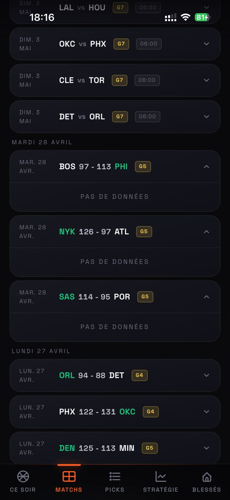
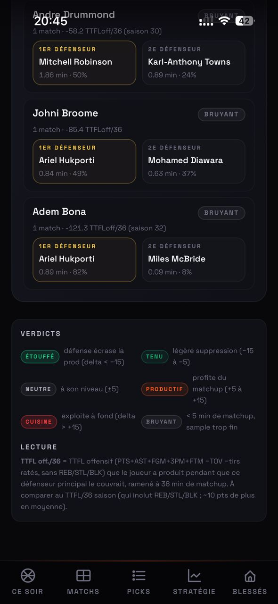
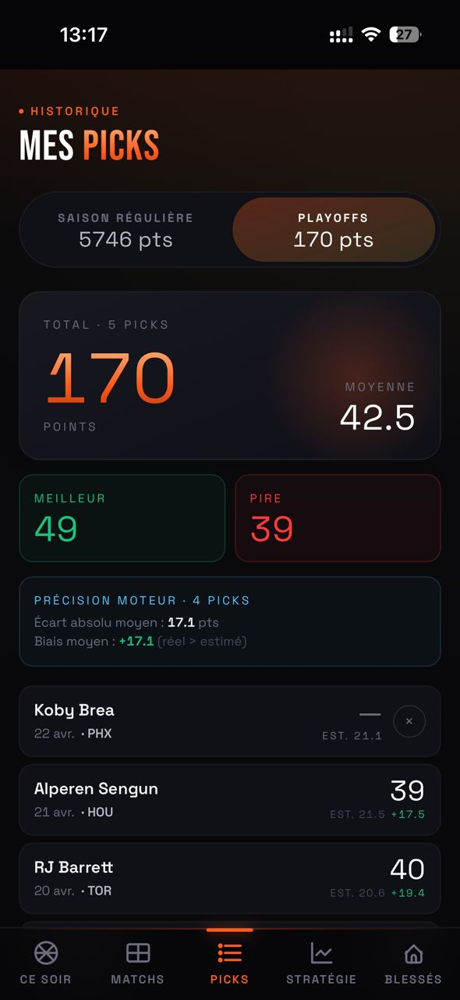
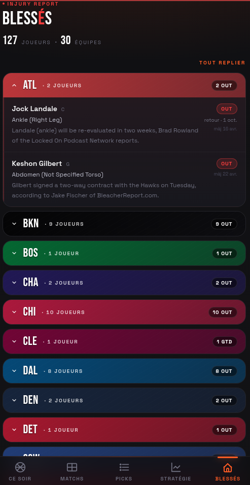

# Guide utilisateur

## Écrans de l'app

### `/` — Ce soir (accueil)

- Header "CE SOIR" + date + nombre de matchs + bouton refresh
- Pastille de dernière synchro (verte < 12h, orange sinon)
- Matchs du soir repliables (série, game number, tip-off)
- Bandeau stratégie : capital restant (X elites, Y solides, Z fillers) + jours restants estimés
- **Opportunités blessures** (violet) : top 3 joueurs avec teammate OUT
- **Top 3 recommandations** : cartes avec rang, score estimé, matchup, tier, tags
- Liste complète des 50 joueurs classés (repliable)

### `/player/[id]` — Fiche joueur

- Identité + position + match du soir + score estimé
- 3 stats : avg TTFL L5, avg saison, floor · ceiling
- Blocs **POUR** / **CONTRE** / **VERDICT** détaillés
- Bouton "Picker ce joueur ce soir"

### `/games` — Matchs

- Calendrier et résultats par jour, avec numéro de game de la série
- Un match terminé se déplie sur les **matchups défensifs** : qui a défendu sur qui, TTFL offensif produit face à chaque défenseur, verdicts (étouffé / tenu / neutre / productif / cuisine)

  
  

### `/picks` — Mes picks

- 2 onglets : **Saison régulière** / **Playoffs** avec totaux séparés
- Stats : moyenne, meilleur, pire pick
- Historique complet des picks avec badge x2 bonus si applicable
- **Précision moteur** : écart absolu moyen et biais entre score estimé et score réel

### `/strategy` — Stratégie

- **Capital restant** (elite/solide/filler)
- **Plan de la semaine** : 1 joueur assigné par jour via algo hongrois, score estimé, badge élimination si applicable
- **Calendrier 7 jours** : barres d'intensité, badge BEST sur le soir premium
- **Séries en cours** : score, games restants estimés, badge ELIM si 3-X

### `/injuries` — Blessés

- Groupés par équipe (header aux couleurs NBA officielles)
- Repliables (fermés par défaut) — bouton "Tout déplier"
- Par joueur : nom, blessure (ex: "Achilles (Right Leg)"), commentaire ESPN, date de retour, date de mise à jour ESPN

---

## Workflow recommandé

### Dimanche soir ou lundi matin — Plan de la semaine (15 min)

1. Ouvre **Stratégie** → regarde le **Plan de la semaine**
2. Copie les picks sur le site TTFL pour la semaine
3. Garde 1 slot "flex" (le moins sûr) non validé si tu hésites

### Chaque jour à 17 h — Review rapide (5 min)

1. Le cron de 17h a tourné (recos définitives)
2. Check l'onglet **Blessés** : ton joueur du soir est-il impacté ? Un coéquipier majeur adverse est-il OUT ?
3. Si changement critique → swap avec un remplaçant équivalent ou ton slot flex
4. Sinon → laisse le pick tel quel

### 3 règles anti-regret

1. **Ne change jamais par "fomo"** — un joueur qui chauffe sur Twitter n'est pas une raison de casser ton plan
2. **Swap seulement si info nouvelle** depuis ton plan (blessure annoncée, starters shake-up)
3. **Lundi matin — post-mortem 2 min** — regarde tes picks ratés, apprends, sans sur-réagir (la variance du jeu est réelle)

